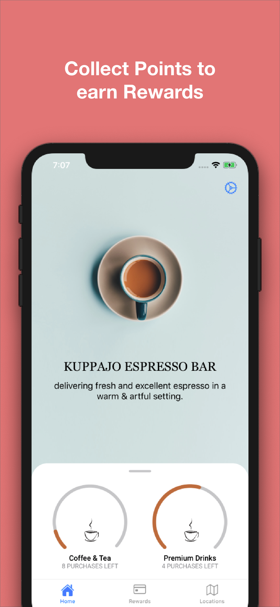
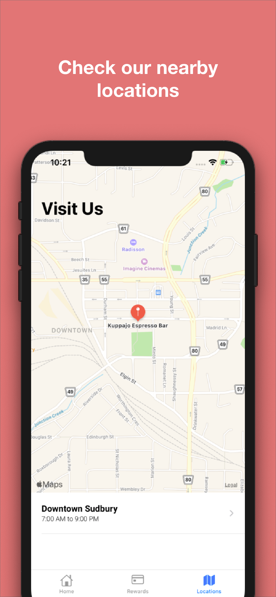
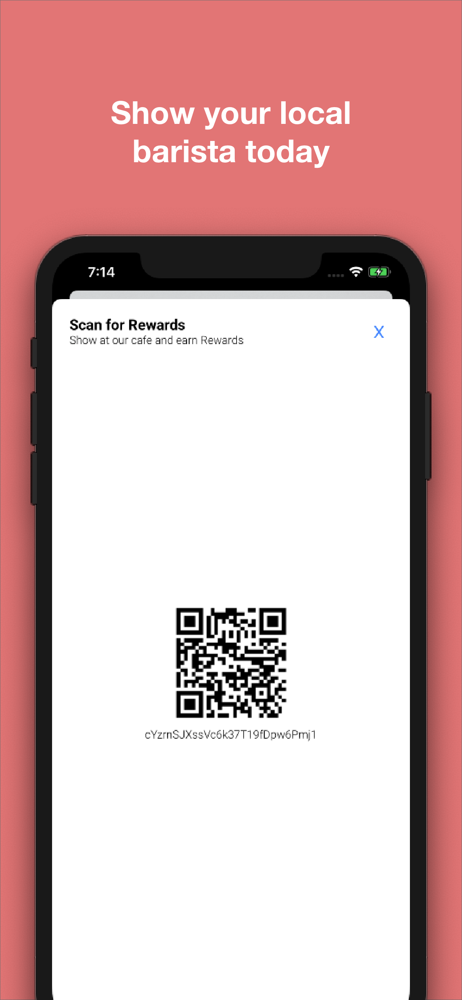

# Kuppajo - Rewards & Online Ordering IOS App

This IOS app was developed for Kuppajo Espresso Bar to establish an Online Rewards Program and allow users to order throught the phone. 

Developed using Swift, and Firebase (Google Cloud) for Auth and Database

Key Components included in App: 
- Auth Providers: Google Sign In, Facebook Sign In and Apple Sign In
- Database calls via Firebase Firestore
- Converting code to QR Image
- Creating extensive views using TableView, CollectionView and Navigation Controllers
- Creating custom classes for Data such as Menu Items and Locations
- Generating Apple Maps and adding custom Annotations
- Using MVC to pass data securely between controllers

Visit the App on the Apple App Store at: 
https://apps.apple.com/us/app/kuppajo-espresso-bar/id1492371597?ls=1

Screenshots:

 
